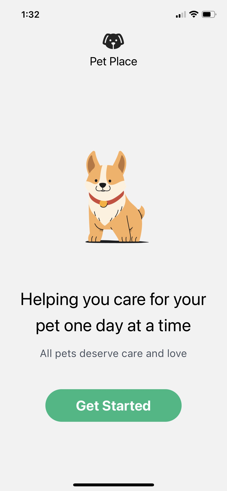
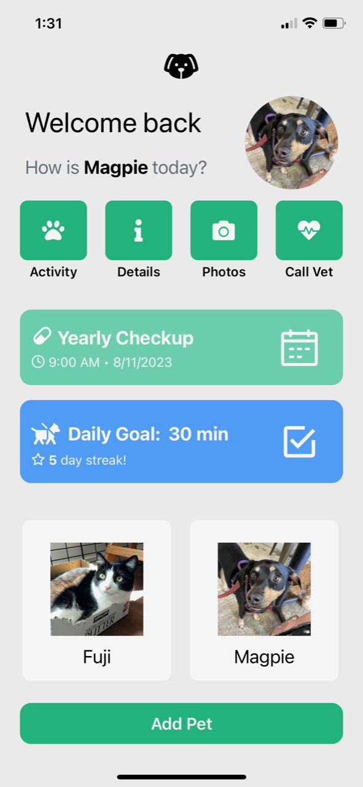
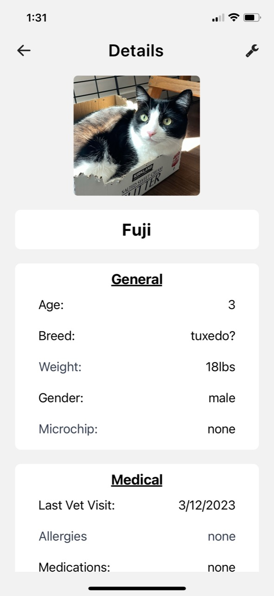
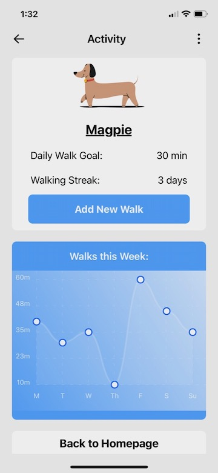
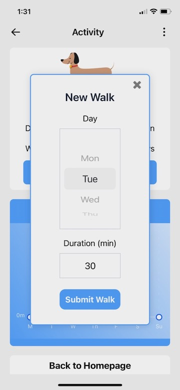
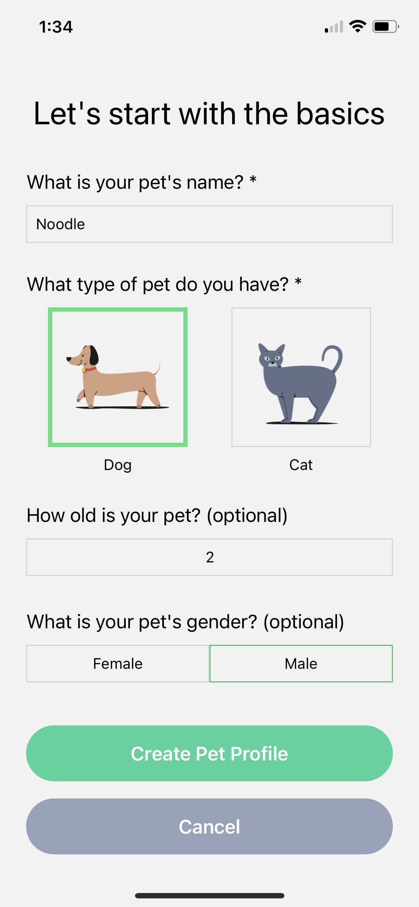

# React Native Pet Place

React Native Pet Place is a mobile app for pet owners. With Pet Place, owners can keep track of their pets' information and activities all in one place.

Notable features include:

Landing Screen:

Home Screen:

- A homescreen with a scrollable, horizontal list of a user's pets, along with the selected pet's relevant details and reminders.
- Profile pictures of the user's pet(s).

Details Screen:

- Editable pet details including age, breed, weight, microchip number, and medical information. All information is optional, and data is stored only on the user's device.

Exercise Screen:

- The ability to track a pet's daily exercise and view that information in a clean, visually appealing chart.
- Adjustable exercise goals and the motivation to earn and maintain a streak when these goals are met.

Exercise Screen 2:

New Pet Screen:

- Users can add additional pets to track their detail and care. Currently, Pet Place supports dogs and cats.

Important Contacts & Appointments Screen:

- Critical contact numbers are stored for easy access in times of need. Possible contacts may include vets, emergency vets, pet sitters, animal poison control, and boarding facilities.
- Add appointments to a calendar to keep track of future pet-related appointments.

(Screenshot coming soon)

# Pet Care

React Native, TypeScript, Expo, Tailwind (via twrnc), react-redux, navigation, async storage
