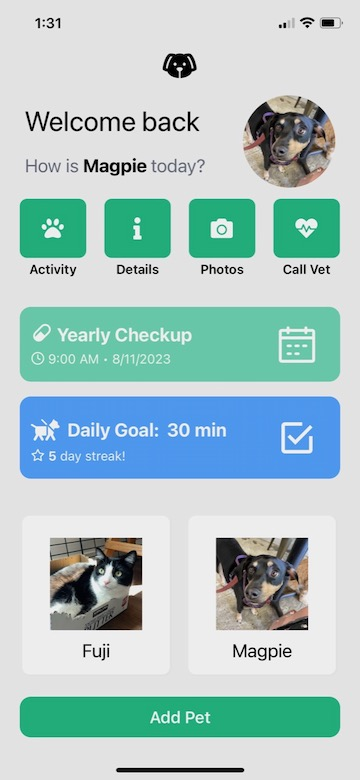

# React Native Pet Place

React Native Pet Place is a mobile app for pet owners. With Pet Place, owners can keep track of their pets' information and activities all in one place.

Landing Screen:

Home Screen:

Details Screen:

Exercise Screen:

Exercise Screen 2:

New Pet Screen:

# Pet Care

React Native, TypeScript, Expo, Tailwind (via twrnc), react-redux, navigation, async storage
